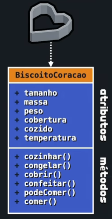

# Programacao Orienta a Objeto

Para que possamos enteder o que se trata esse avanço da tecnologia e necessario que entendermos alguns pontos da evolucao das liguagens de programcao ate que chegamos no nivel que estamos hoje.

## Crise de software de 1960

Para um breve contextualizacao, muito antigamente quando os computadores foram criados era necessario uma programcao por cartuchos perfurados, este metado deixava muito limitado o nivel do que poderiamos fazzer um um computador, com o tempo se passando foi necessario se criar uma linguagem para que os seres humanos conseguisem se comunicar com os computadores com isso surgiu a primeira linguagem comoputacional.

A linguagem chamada Assembly, esta linguagem por muitas das vezes nao era estruturada entao nao tinha formas basicas como loops ou condicionais. Pare resolver este problema que se foi criado a primeira liguagem estruturada Algol 60, criada em 1960, para resolver o problema do Assembly nela ja era estruturada entao ja tinhamos blocos de codigos de inicio e fim, loosp e if/else.

Com tudo ainda tinhamos um grande problema, com tudo os codigos ainda nao eram Modularizados, entao todo o codigo ficava em um so arquivo gigante, com o tempo foram evoluindo e conseguiram se fazer com que os codigos fosse modularizados e bem separados.

## A onde entra a Programação Orientada a Objetos ?

Na prgramacao ainda havia muitos problemas, os codigos eram ainda uma estrutura muito complexa de se manusiar e realizar algumas funcoes, muito espalhados com funcoes modulares ainda para cada coisa, com a ideia da orientacao a objetos era de se juntar tudo de uma determinada coisa em um so. Mas isso iremos entender melhor quando chegarmos na explicacao.

## Nomeclaturas e vantagens

A nomeclatura em portugues Brasil e como esta escrito Anteriormente, **Programacao Orientada a Objetos com a sigla POO,** ja em muitos casos que iram esta em ingles a sigla e o nome ficariam **Object Oriented  Programming sendo a sigla OOP**.

Certo agora que sabemos o contexto, os nomes precisamos entender as vantagens e  porque de usar isso nos dias atuais. Nenhum codigo hoje em dia tem a utilizacao de OOP. Antes de tudo  vamos enteder como funciona um Objeto com a utilizacao do exemplo mais comum de uma carro e como funciona.

Um Objeto pode ser explicavel como tudo que e palpavel normalmente, pois ele seria um grupo que tem algumas funcoes especificas, imagine em uma montadora de carro, o carro em si seria o objeto por completo, entretanto quando iremos montar um carro cada parte e imdependete e se comunica com a outra, por exemplo, quando a pessoa que esta fazendo os bancos esta colocando eles, nao necessariamente a pessoa que esta fazendo o motor precisa esperar ou enteder de como funciona a colocaçao dos bancos e versi versa.
**Ta podemos entender melhor como funciona mas vou melhor isso com o tempo.**

OOP tem suas vantagens e para que voce possa entender uma paavras como **COMER NADA** pode ajudar muito a entender os paramentros.

* **Cofiavel** - Uma das partes tem que serem tratadas individuais, nao afetando as outras partes
* **Oportuno** - Quando separadas em partes cada parte deve ser capaz de ser desenvolvida em paralelo com as outras sem impecilhos
* **Manutenivel** - As partes tem que ser de facil manutensao, se uma forma que nao afete todo o progama.
* **Extensivel** - De ver capaz de acrecentar coisas em alguma parte sem afetar todas, apenas fazendo algumas alteracoes na parte especifica
* **Reutilizavel** - Deve ser capaz de ser reutilizael em diversos casos
* **Natural** - Tudo deve ser de forma natural sem parecer esta forcando o programa a realizar

## O que sao Classes, Atibutos e Metados

Antes de criamos um Objeto e necessario criar o que dara foma aos objetos, esta estrutura nos chamamos de **Classe** esta forma de estrutura e onde iremos passar as regras para criamos um objeto.

Para um melhor intendimento vamos entrar em um raciocinio mais simples, antes de darmos nomes tecnicos.
Imagine que voce esta fazendo um bolo, este bolo deve ter o formato de estrela, para que o mesmo tenha este formato é necessario que possua uma forma em formato de estrela assim todos os bolos que voce fazer iram ter o mesmo formato.
E**m base isto seria o chamamos de classe.** Uma classe e o **conjunto de caracteristicas e acoes que iram ter o seu objeto**
Na classe tambem temos as caracteristicas que em outras palavras chamamos de **Atibutos**, so eles que daram aspctos a classe. Tambem temos aquilo que chamamos de ações que sao os **Metados**, aqui ira ocorrer as acoes que a classe sofrerar.

Vamos agorar usar um exemplo de uma construcao de uma casa;
O engenheiro vem para realizar um planta de uma casa, ele começa a desenhar uma planta simples **(planta olhada de cima), esta planta seria nossa Classe**, nosso atributo seria o **tamanho da casa, a cor, andares,** ja os nossos metados seriam algo como, **se a casa e movel, derrubar a casa, pintar a casa, mobilhar.**

Isso tambem poderia ser para o bolo sendo a forma a classe tendo o **tamnho, temperatura, sabor, cozido sendo os Atributos**
Ja os **Metados sendo, comer, partir, cozinhar, guardar.**

Show, agora que entendemos esta parte e necessio que sabemos montar uma classe, para isso e necessario sabermos o diagrama de classe da UML.
Veja o Exemplo do bolo abaixo;


Temos 2 conceitos importantes que devemos saber deles.
 1- **Instancias** - E o ato de fazer com que a classe se torne um objeto, e o momento que passamos a planta da casa para os pedreiros e eles estao contruindo, ali acontece a instancia, fazendo assim uma classe se tornar um objeto expecifico

 2-**Estado** - O estado e tudo que um objeto esta no momento, como o bolo a temperatura, tamanho, sabor tudo junto e um estado, este estado muda com o passar do tempo, ja que um objeto na maioria das vezes nao e fixo 

==========================================================================================

## Como criar uma Classe e um Objeto

Para a criacao de um classe e um objeto temos varios fatores importantes de se endender, vamos para a pratica e destrinchamos cada parte

### Como criar uma Classe

```
#DECLARACAO DE CLASSE
class Gafanhoto:
    def __init__(self): #Metador construtor
        # Atributos
        self.nome = 'desconhecido'
        self.idade = 0

    #Metados 

    def aniversario(self):
        self.idade += 1
    
    def mensagem(self):
        return f'{self.nome} é Gafanhoto e tem {self.idade} anos'

g1 = Gafanhoto()
g1.nome = 'Ana'
g1.idade = 15
g1.aniversario()
g1.aniversario()
print(g1.mensagem())

```

Vamos descrinchar cada parte 

  1 - **Nomeclatura da class;** Nesta parte todo nome de uma classe deve ser com **Letra Maiuscula** 
  2 - Definicao do metato contrutor;** __int__** e para criar a funcao que irar **receber os atributos do objto quando instaciado**. Ja o** self**, ele e o metado construtor ele sera a variavel generica que irar ser como um atributo e **identificar de qual objeto estamos modificando**.
  3 - **Adicao de atributos;** Dentro da funcao __int__, iremos colocar os atributos sendo **self.nomeAtributo = seu_valor**.
  4 - **Criacao de metados;** Fora desta funcao iremos criar nossa funcao de metados, para isso voce irar criar a funcao e passar o atributo de **self**.
  5 - Fora e onde iremos estaciar nosso Objeto, e onde criaresmo com g1 nome do objeto e chamar a classe Gafanhoto()
  6 - Passaremos os atibutos (Esta nao e a forma mais ideal para que possamos passar)
  7 - Logo chamaremos nossos metados.

Aqui vimos uma forma simplificada e com um exemplo simples so para que possamos entender como criar uma classe e instaciar um objetos. A varias formas e regras para que possamos otimizar nosso classe.

## Otimizacao da Class e Criacao de Documentacao

Vamos usar o exemplo anterior mas colocando algumas modificacoes para que seguicemos o pradrao geral

```
class Gafanhoto:
    '''
        Esta classe cria um Gafanhoto
        Variavel = Gafanhoto(nome, idade)
        return nome e idade
        return aniversario (idade + 1)
    '''
    def __init__(self, nomeUsuario='desconhecido', idadeUsurario=0): #Metador construtor
        # Atributos
        self.nome = nomeUsuario
        self.idade = idadeUsurario

    #Metados 

    def aniversario(self):
        self.idade += 1


    def __str__(self):
        return f'{self.nome} é Gafanhoto e tem {self.idade} anos'
    

    def __getstate__(self):
        return f'Nome: {self.nome}, Idade {self.idade}'


#dECLARACAO DE OBJETOS

g1 = Gafanhoto('Adryan', 20)

g1.aniversario()
print(g1)
print(g1.__getstate__())
print(g1.__doc__)
print(g1.__dict__)
print(g1.__class__)
```

1 - **Atributos;** Mudanca na onde se coloca um atributo assim como nas funcoes normais colocamos **variaveis para receber e depois passamos para o self**
2 - **__srt__ ;** Isso e uma mensagem padrao que irar aparecer sempre que **chamarmos nosso objeto.**
3 - **__getstate__ ;** Aqui irar mostrar o **estado que se encontra o objeto,** pode pegar so os atributos mas tambem pode pesonalizar por padrao ele mostra em forma de dicionario
4 - **__doc__ ;** Tudo no Python e um objeto aqui voce vai chamar a documentacao deste objeto, que voce pode ver que foi criada no inicio do codico com **"""conteudo"""**
5 - **__dict ; ** Ele irar mostrar o objeto em **forma de dicionario**, que se pode trabalhar no mesmo
6 - **__class ; ** Mostra de qual **classe e o objeto**

